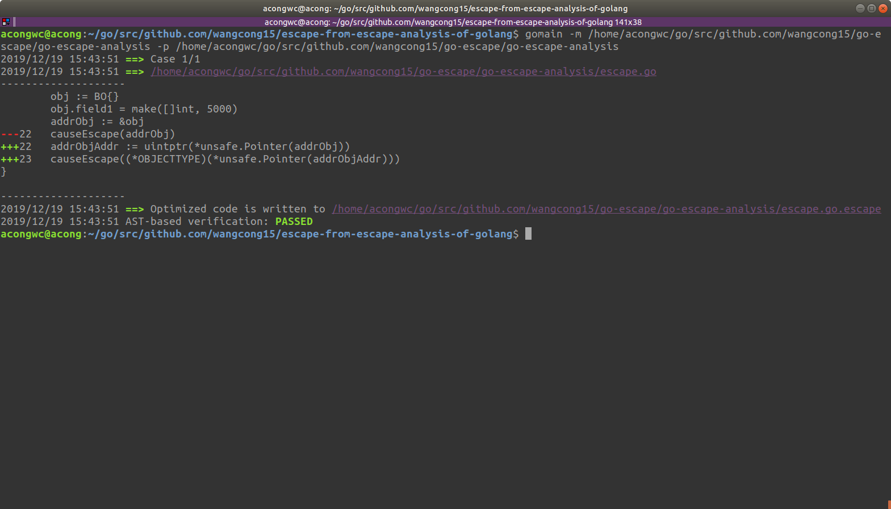
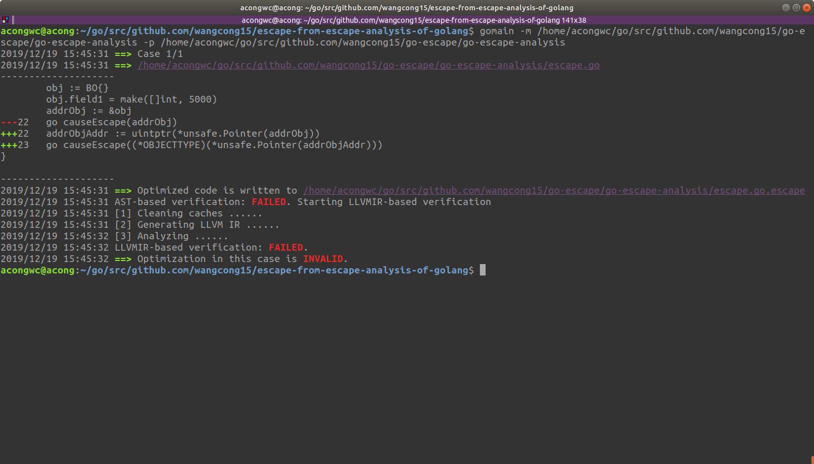

# Escape from Escape Analysis of Golang
This is the source code of our paper submitted to SEIP-ICSE 2020. In this paper, we propose an escape analysis optimization approach for Go programming language (Golang), aiming to save heap memory usage of programs.

# Get Started
### install Go-IR
1. install gollvm.
2. install python.
3. run command "cd Go-IR && sudo python setup.py install".
4. install missing dependencies if any warnings.

### install
1. install golang.
2. run command "go get github.com/wangcong15/escape-from-escape-analysis-of-golang".

### usage
1. run command "escape-from-escape-analysis-of-golang -p {project} -m {main}". notice that `{project}` is the path of Golang project, and `{main}` is the path of main package.
2. just watch it running. it prints the optimization cases and validation results.
3. the execution is totally automatic.

### screenshot
The following figure shows the screenshot of a good optimization. Changing the code does no harm to memory safety in this code snippet. Variable `addrObj` is used as a function parameter of function `causeEscape`, which is a synchronous call. Due to the synchronous nature of its function calls, AST-based verification method decide that `obj` (the object which `addrObj` points to) should not be in heap. Thus we can change the statements to optimize the memory usage.

On the other hand, when we add a word `go` ahead of this code statement, things will change. Function call `causeEscape` turns to  asynchronous. AST-based method cannot make decisions on syntax level. We use the LLVM IR (Intermediate Representation) to analyze the code. We locate the specific file, specific pointer and specific line of code. The goroutine function `causeEscape` has reading operations on the pointer `addrObj`, which makes it a problem that it memory address might be cleaned or covered before these operations end. Thus we decide the optimization in this case is not correct. 

With any problems, pleases write issues or contact us (wangcong15@mails.tsinghua.edu.cn).
Thank you very much.